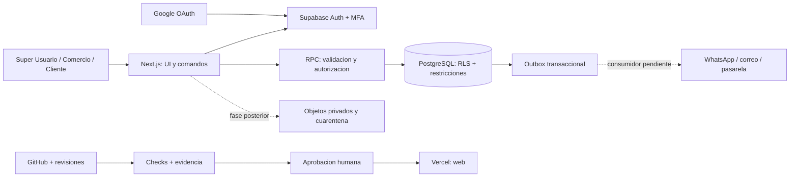

# 02. Arquitectura de referencia

## Un monolito modular, no un sistema distribuido prematuro

La unidad de despliegue inicial es una web Next.js. La unidad de autorización es
el comercio y su membresía activa. La autoridad de integridad es PostgreSQL.

El dibujo expresa arquitectura objetivo y dependencias; las líneas punteadas
son componentes pendientes, no conexiones efectuadas.

## Estructura del código

`src/domain` contiene importes, estados, permisos y contratos sin dependencias de
UI o red. `src/app` contiene rutas, composición y comandos de Next.js. `src/lib`
encapsula acceso al proveedor, contexto autenticado y generación de documentos.
`src/config` contiene identidad visual provisional. `supabase/schema` contiene
fuentes iniciales, no migraciones aplicadas. Las pruebas SQL evalúan el
comportamiento del esquema y no solo buscan la palabra RLS.

No se crean directorios vacíos que aparenten ser módulos implementados. Al crecer,
extraer los casos de uso a `src/modules/<modulo>/application`, sus interfaces a
`domain` y adaptadores a `infrastructure`, sin obligar a desplegarlos separados.

## Límites del dominio

| Módulo | Propiedad de datos | No debe hacer |
|---|---|---|
| Identidad y acceso | Usuarios externos, membresías, privilegio plataforma | Determinar roles por metadata del usuario |
| Comercios | Alta, slug, estado y configuración | Mezclar sesiones o credenciales entre comercios |
| Reparaciones | Recepción, asignación, estados e historia | Convertir completado en pago confirmado |
| Pagos operativos | Movimientos ligados a una orden | Cobrar la suscripción del software |
| Facturación SaaS | Plan, vigencia y estado por negocio | Mezclar ingresos del taller con ingresos SaaS |
| Documentos | Snapshot y representación de comprobantes | Inventar verificación fiscal o de fondos |
| Integraciones | Adaptadores, reintentos y entregas | Confirmar pagos por retorno del navegador |
| Auditoría | Quién cambió qué y cuándo | Registrar contraseñas, tokens o formularios enteros |

Inventario y ventas necesitarán movimientos, reservas, devoluciones, coste y
relaciones con reparaciones. El inventario no será un número editable sin
historia. Se incorporarán en una migración independiente con su propia cobertura.

## Fronteras de confianza

El navegador se considera manipulable. Un tenant_id, URL, botón oculto o token
válido no acredita autorización por sí mismo. El servidor valida forma/origen e
identidad; SQL verifica rol actual, relación del registro, estado del negocio y
MFA cuando corresponde. Las llamadas directas a RPC deben seguir siendo seguras
sin pasar por nuestra UI.

Los usuarios usan la clave publicable y su sesión. No se necesita service_role
para CRUD normal. Las funciones privilegiadas residen en `private`, tienen
search_path vacío, nombres cualificados y comprobaciones explícitas. Los wrappers
públicos son security invoker. Los permisos EXECUTE se conceden de forma
explícita; las tablas no permiten escrituras directas del rol authenticated.

## Consistencia y concurrencia

Una orden, su primer evento, voucher y evento outbox se crean en la misma
transacción. Una confirmación de pago y su voucher también. Los cambios técnicos
usan versión esperada y bloqueo de fila. Confirmar varias veces el mismo pago no
debe generar varios vouchers. La clave de idempotencia se conserva durante el
intento de un formulario; una nueva intención con otra clave no se deduplica
mágicamente. Conciliación y controles de duplicados siguen siendo necesarios.

Outbox evita perder el evento entre el commit y un futuro envío, pero **el
consumidor no está implementado**. El diseño objetivo entrega al menos una vez,
reintenta con backoff y deduplica por evento. No se promete exactly-once entre
proveedores independientes ni se realizan envíos dentro de una transacción SQL.

## Configuración

Separar: configuración de despliegue; identidad de plataforma; ajustes por comercio;
capacidades por plan; preferencias del usuario; secretos por integración. Una
bandera de interfaz no concede permisos. Los cambios financieros requieren
revisión de la matriz, migración, auditoría y pruebas. Los precios no son
constantes del frontend y aún no están definidos.

## ADR iniciales

ADR-001: monolito modular por simplicidad operacional. ADR-002: PostgreSQL
compartido con tenant_id y RLS por coste/control, conservando opción de aislamiento
físico futuro. ADR-003: migraciones SQL como autoridad, sin ORM privilegiado.
ADR-004: pagos operativos y SaaS separados. ADR-005: prohibir cache compartida de
datos autenticados. ADR-006: marca intercambiable sin renombrar infraestructura.
ADR-007: tareas duraderas mediante outbox/worker, no promesas en memoria.
ADR-008: el agente ayuda a revisar, pero no certifica ni aprueba su propio cambio.

Cada ADR nuevo debe incluir contexto, alternativas, decisión, consecuencias,
estado, responsable y fecha; las decisiones de producto pendientes no se
convierten en aprobaciones por quedar escritas en código.
